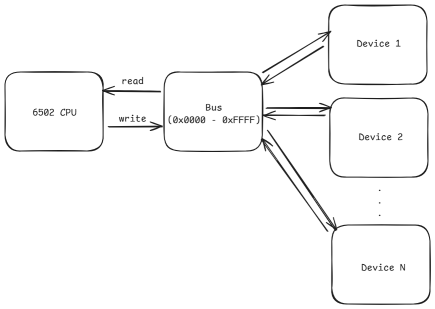

# MOS Technology 6502

The MOS Technology 6502 microprocessor was used in many 8-bit era computer designs due to its reasonable performance and relatively low price.

Numerous microcomputers (Apple I-II, Commodore PET, Commodore 64, BBC Micro etc.), game consoles (Atari 2600, Nintendo Entertainment System, etc.) and other devices used this processor as a central piece of their architecture. 
The 6502 CPU undoubtedly played a key role in the 70-80s home computer revolution.

This library attempts to replicate the behavior of the legendary 6502 microprocessor.

## Features

### Cycle accuracy
The `Core` class executes instructions in a clock cycle accurate manner.
The 6502 was designed in a way that a read/write operation occurs in every cycle.
This implementation respects that behavior, even dummy reads/writes are performed.

The cycle-by-cycle execution is heavily based on Appendix A titled "Summary of Single Cycle Execution" found in the [MCS6500 Microcomputer Family Hardware Manual](https://web.archive.org/web/20221106105459if_/http://archive.6502.org/books/mcs6500_family_hardware_manual.pdf).

Every instruction belongs to one of five categories:
- store
- single byte
- read-modify-write
- internal execution on memory data
- control flow and stack operations (miscellaneous)

A given instruction consists of a sequence of execution steps (addressing mode) and an operation which takes place in the last clock cycle.
During execution the `Decoder` class determines the actual instruction from the current opcode then performs the corresponding step.

### Bus


The CPU uses the `Bus` class as a bus abstraction to read from and write to addresses.
On read and write operations the bus forwards the request to the specific device.

Any device which implements the `IDevice` interface can be connected to the bus.
A device has one or more address spaces, and a mask can be applied to the given address to translate the global address to a device specific one, or achieve address mirroring.

Each address is a 16 bit value so the global addressable space is from `0x0000` to `0xFFFF`;

### Signals
Despite the fact that the original 6502 uses inverted inputs in several cases, this implementation uses a logical `true` if a signal is active and a logical `false` if it's inactive.

The following signals can be used on the core:
- **RDY:** Ready. Halts the execution. If the signal becomes active in a cycle when a write operation occurs, then the CPU isn't stalled until the next read cycle.
- **RW:** Read/not write. Used internally to indicate that a write operation will occur at the next tick. 
- **SYNC:** Opcode fetch. Becomes true at the very beginning of every instruction cycle when the opcode fetch takes place.
- **RES:** Reset. When active, the processor goes through the interrupt sequence and fetches the reset vector. Level triggered.
- **NMI:** Non-maskable interrupt. On low-high transition the processor goes through the interrupt sequence and fetches the NMI vector. Edge triggered.
- **IRQ:** Interrupt request. When active, the processor goes through the interrupt sequence and fetches the IRQ vector. Can be masked. Level triggered.

### Decimal mode
This implementation supports binary coded decimal addition and subtraction. Every affected flag is set correctly in decimal mode after these operations.

## Usage

To use the 6502 core you need to create a `Bus` instance first which can be used by the core itself.
```csharp
var bus = new Bus();
var cpu = new Core(bus);
```

After that you can connect the desired devices to the bus. Every device must implement the `IDevice` interface and every device belongs to at least one address range. If you wish you can use a mask on the address and the device only sees that masked address instead of the original one.
```csharp
var ram = new Ram(); // implements IDevice
var rom = new Rom(); // implements IDevice

bus.Connect(ram, new Bus.AddressRange(0x0000, 0x7FFF));
bus.Connect(rom, new Bus.AddressRange(0xE000, 0xFFFF), mask: 0x1FFF);
```

Then the core is ready for program execution:

```csharp
cpu.Tick(); // execute a single cycle
cpu.Step(); // execute a single instruction, or finish an already started one
cpu.Reset(); // go through the interrupt sequence and fetch the reset vector

cpu.Signals.IRQ = true; // trigger an interrupt on the next tick (before the next opcode fetch)
cpu.Signals.RDY = true; // stall the core on the next tick (only if it's a read cycle)
```

## Tests

The [CPU.MOS6502.Tests](../CPU.MOS6502.Tests/README.md) project contains the test suite to validate this implementation.

## Useful Resources

- [MCS6500 Microcomputer Family Hardware Manual](https://web.archive.org/web/20221106105459if_/http://archive.6502.org/books/mcs6500_family_hardware_manual.pdf)
- [MCS6500 Microcomputer Family Programming Manual](https://web.archive.org/web/20221106105459if_/http://archive.6502.org/books/mcs6500_family_hardware_manual.pdf)
- [Synertek Datasheet](https://www.princeton.edu/~mae412/HANDOUTS/Datasheets/6502.pdf)
- [6502 Instruction Set](https://www.masswerk.at/6502/6502_instruction_set.html)
- [Instruction Reference](http://www.6502.org/users/obelisk/6502/reference.html)
- [Instruction reference (Nesdev Wiki)](https://www.nesdev.org/wiki/Instruction_reference)
- [Investigating Interrupts by Garth Wilson](http://www.6502.org/tutorials/interrupts.html)
- [CPU interrupts](https://www.nesdev.org/wiki/CPU_interrupts)
- [Status flags](https://www.nesdev.org/wiki/Status_flags)
- [The 6502 overflow flag explained mathematically](https://www.righto.com/2012/12/the-6502-overflow-flag-explained.html)
- [Reverse-engineering the 8085's decimal adjust circuitry](https://www.righto.com/2013/08/reverse-engineering-8085s-decimal.html)
- [Flags on decimal mode on the NMOS 6502](https://forums.atariage.com/topic/163876-flags-on-decimal-mode-on-the-nmos-6502/)
- [Visual6502wiki/6502DecimalMode](https://www.nesdev.org/wiki/Visual6502wiki/6502DecimalMode)
- [6502 branch offset calculation](https://retrocomputing.stackexchange.com/questions/7327/6502-branch-offset-calculation)