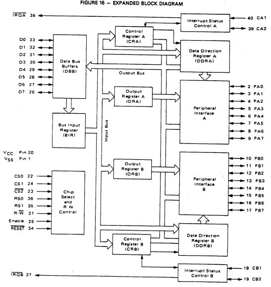

# Motorola MC6821 PIA

The Motorola MC6821 Peripheral Interface Adapter (PIA) is used to connect peripheral devices to the microprocessor.
The PIA was also manufactured by other vendors: the MOS Technology 6520 chip has the same functionality and pinout but different properties.



*Block diagram sourced from the Motorola MC6821 Datasheet*

The PIA is divided into two sides (section **A** and **B**) and each side can be used individually.
The two sections are almost identical besides some differences regarding electrical characteristics and handshake mode behavior.

The PIA provides:
- two bidirectional 8 bit buses interfacing with peripherals (**PA0-PA7**, **PB0-PB7**)
- two programmable control registers (**CRA**, **CRB**)
- two programmable data direction registers (**DDRA**, **DDRB**)
- four configurable interrupt control lines; two can be used as output (**CA1**, **CA2**, **CB1**, **CB2**)

For more information see the [Useful Resources](#useful-resources) section.

## Usage

The `Adapter` class represents the PIA and implements the `CPU.MOS6502.IDevice` interface.
```csharp
var pia = new Adapter();
var bus = new CPU.MOS6502.Bus();

bus.Connect(pia, new CPU.MOS6502.Bus.AddressRange(0xD010, 0xD013), mask: 0x03);
```

Any peripheral that implements the `IPeripheral` interface can be connected to the PIA's **A** or **B** side.
```csharp
var keyboard = new Keyboard(); // implements IPeripheral
var display = new Display(); // implements IPeripheral

pia.Connect(PortSection.A, keyboard);
pia.Connect(PortSection.B, display);
```

Data can be read from or written to four (masked) addresses:
- **0:** section A port or DDRA, depending on CRA bit 2 value
- **1:** CRA
- **2:** section B port or DDRB, depending on CRB bit 2 value
- **3:** CRB
```csharp
var data = pia.Read(0);
pia.Write(3, 0xAB);
```

The control lines can be used in the connected peripherals:
```csharp
// get a reference to the connected port inside the implemented Connect method
public void Connect(Internals.Port port)
{
    // generate a high-low transition on control line 1
    port.InterruptControl.C1 = true;
    port.InterruptControl.C1 = false;
}
```

When an interrupt occurs and is not masked, the interrupt line becomes active. The interrupt line resets if data is read from the corresponding data register. 
```csharp
var irqA = pia.IRQA; // get the state of port A interrupt
pia.Read(0); // clears IRQA if the data register is selected by CRA bit 2

var irqB = pia.IRQB; // get the state of port B interrupt
pia.Read(2); // clears IRQB if the data register is selected by CRB bit 2
```

This implementation works asynchronously, so the **Enable** signal is only needed if one of the control lines (**CA2**, **CB2**) is in handshake mode with enable restore.
```csharp
pia.Enable(); // clock tick inside e.g. an emulation loop
```

## Tests

The [Device.PIA.Tests](../Device.PIA.Tests/README.md) project contains the test suite to validate this implementation.

## Useful Resources
- [MC6821 Datasheet](https://www.alldatasheet.com/datasheet-pdf/pdf/4149/MOTOROLA/MC6821.html)
- [Hitachi HD6821 Datasheet](https://www.alldatasheet.com/datasheet-pdf/pdf/63672/HITACHI/HD6821.html)
- [W65C21 Peripheral Interface Adapter (PIA)](https://www.westerndesigncenter.com/wdc/w65c21-chip.php)
- [MCS6520 Peripheral Adapter](https://web.archive.org/web/20160611082505if_/http://archive.6502.org/datasheets/mos_6520.pdf)
- [R6520 Peripheral Interface Adapter (PIA)](https://web.archive.org/web/20221103020112if_/http://archive.6502.org/datasheets/rockwell_r6520_pia.pdf)