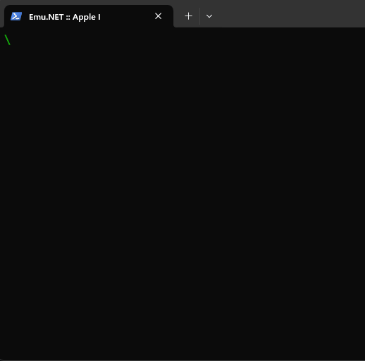

# Emu.NET :: Apple I

This console-based project aims to emulate the [Apple I](https://en.wikipedia.org/wiki/Apple_I) 8-bit home computer.



*The emulator running an Apple BASIC game named [Mini-Startrek](https://apple1software.com/games/mini-startrek/).*

## Features

This project is built on top of the [CPU.MOS6502](../CPU.MOS6502) and [Device.PIA](../Device.PIA) projects. 
The emulator uses purely the terminal, no other GUI layer is involved.
Any Apple I program can be loaded into the RAM's 32K address space in binary form.
Although the original Apple I had a clock frequency of approximately 1 MHz, the execution speed is not regulated.

## Usage

### How to Run
To run the emulator, use the following command in the project root:
```shell
dotnet run
```

To load programs into RAM in binary form, use:
```shell
dotnet run -- --binary program.bin
```

The starting memory location can be specified in hexadecimal form after the path separated by a colon:
```shell
dotnet run -- --binary program.bin:0300
```

Multiple binaries can be loaded at once:
```shell
dotnet run -- --binary ms-zero-page.dat:004a mini-startrek.bin:0300
```

### Key Bindings
The emulator has two useful key bindings:
- **F2:** resets the system
- **F4:** stops the emulator

### Woz Monitor
The *Woz Monitor* is loaded upon start, which is a 256-byte program used to operate the system.
Programs can be run and memory addresses can be inspected and modified with its help.
The **Esc** key clears the current line and the **Enter** key initiates the execution of a command.
The **Backspace** key deletes a character as expected, but a `_` character is displayed in the terminal.

### Apple BASIC
To run *Apple BASIC* from the *Woz Monitor*, use (cold start):
```shell
E000R
```

If a BASIC program is loaded into RAM, then use (warm start):
```shell
E2B3R
```

To return to the *Woz Monitor*, use the following from the BASIC shell:
```shell
CALL -256
```

### Software Library
Various Apple I programs can be downloaded from [The Apple-1 Software Library](https://apple1software.com/).

>Note: To load BASIC programs, provide the zero-page data in binary form too, which can be found in the *Wozmon Listing*. 

## Memory Map
The emulator has the following memory map:

| Device | Address Range | Size   |
|:-------|:-------------:|:-------|
| RAM    |  0000 - 7FFF  | 32K    |
| Unused |  8000 - D00F  | -      |
| PIA    |  D010 - D013  | 4 byte |
| Unused |  D014 - DFFF  | -      |
| ROM    |  E000 - FFFF  | 8K     |


## Useful Resources
- [Apple-1 Operation Manual (1976)](https://archive.org/details/Apple-1_Operation_Manual_1976_Apple_a)
- [Apple BASIC Users Manual](https://archive.org/details/apple1_basic_manual)
- [The Apple-1 Software Library](https://apple1software.com/)
- [Apple I Replica Creation -- Chapter 7: Understanding the Apple I](https://www.applefritter.com/replica/chapter7)

Happy hacking! :computer: :hammer: